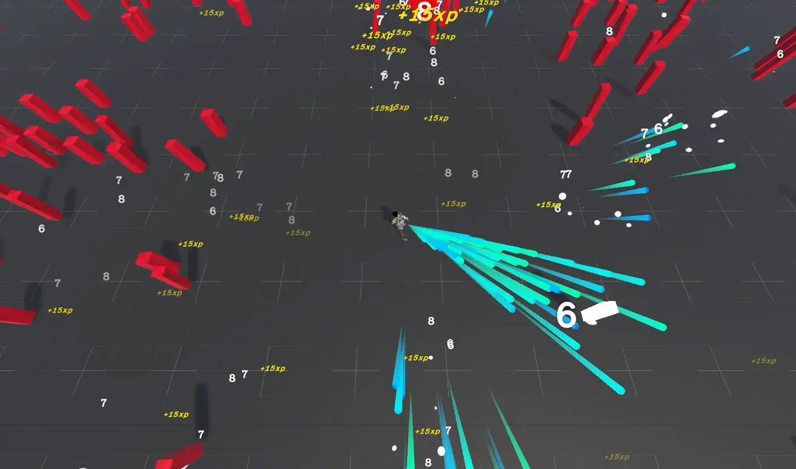
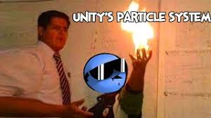

Now, you know the general idea of how unity works. Scenes contain gameobjects, gameobjects contain components, and those components drive the behaviour of the gameobjects. And that is most of what you need to know. After this, you can master different systems (particles, physics, networking), learn how to architect your codebase, understand game design etc. 

# Week 2: 

## The Game:

^^ Example image, you can take inspiration.

Now, lets make a Top Down shooter 3D game, with 3D models, animations, particles, a full game loop, enemy AI (not the LLM or ML kind, it has a different meaning in game dev). For this week, we will have a roadmap of all the basics and features you can implement, with along side the points for each. Ill try adding useful links and tutorials, but this time we wont have a convenient tutorial series like last time. Instead we will pickup different ideas from different tutorials and sources and incorporate them in our game. 

## Roadmap

### 1. Player Controller

First, lets learn some essential topics.

New input system in unity ->
https://www.youtube.com/watch?v=ONlMEZs9Rgw

Now, lets learn about Raycasting ->
https://www.youtube.com/watch?v=B34iq4O5ZYI&t
https://www.youtube.com/watch?v=THnivyG0Mvo

Then I would suggest, learning a little about quaterions and rotations. 
Unity uses quaterions for 3D rotations. 
https://www.youtube.com/watch?v=zjMuIxRvygQ
https://www.youtube.com/watch?v=sJcVJEOwLUs

Look into all the cool vector3 and quaternion functions unity provides, by looking into their documentation.

* Start with a simple capsule for the player model, add a cube or something for a template gun.
* Top Down player controller. Tutorial -> https://www.youtube.com/watch?v=-0GFb9l3NHM&t
* Make the camera smoothly follow the player. This is a tutorial but keep in mind, its not top down, you just have to incorporate ideas from it. This will be the theme for the following linked material. https://www.youtube.com/watch?v=MFQhpwc6cKE

Hopefully, we now have a simple top down player controller, that looks at your mouse. 

### 2. Basic Shooting Mechanics 

Now have two options and either is fine ->
* Every time the player clicks, generate a raycast from a gun to straight ahead.
* Or, you can create a raycast from the screen mouse position to the world using and then make the player's gun point at that.

For the shooting itself, you can use raycasting, or you can make bullets by instantiating game objects, and making them move forwards.

### 3. Enemies, Health and Damage.

Lets learn about pathfinding and the amazing unity tools for it.
https://www.youtube.com/watch?v=SMWxCpLvrcc

A fun video by brackeys :P (https://www.youtube.com/watch?v=G9Otw12OUvE)

* Create enemies that follow the player around.
* You can create different types of enemies, and have them spawn in different rates and situations/locations.
* Add health to the enemies, and make the player hits damage them. (raycast hit, or collider enter).
* Make a way for enemies to damage you as well, by creating a health system for the player. You can make the enemies melee, or give them guns!

### 4. Setup your game loop

* This part is hard and super fun because this requires real system thinking.
* Setup a main menu, then load the game scene. To get deeper into understanding unity's UI system, you can follow the following tutorial -> https://youtu.be/Unnd0cOSiLU?si=jNKOCW4Lm5iiSy6C
* Make the game as your heart desires (single or multiple maps, wave systems, boss fights, exploration based etc.)
* Make a proper way to handle player death (you can reset the level, make spawnpoints etc)
* Add a clean finishing/win state (Try not to make an infinite game this time.). 

### 5. Decoration. 

The fun artistic part!

First learn about post processing ->
https://www.youtube.com/watch?v=9tjYz6Ab0oc

Now, for everyone's favourite, unity's particle system!

https://www.youtube.com/watch?v=0HKSvT2gcuk

Also you can learn about the animation system here ->
(No need to go through the entire series, you can pickup concepts from what you want to make.)
https://www.youtube.com/watch?v=-FhvQDqmgmU&list=PLwyUzJb_FNeTQwyGujWRLqnfKpV-cj-eO

And that wraps it up! This will take a lot of time, of if required we can extend the week to 1.5-2 weeks. After all, you are learning a lot, and I mean A LOT, of different systems here.

