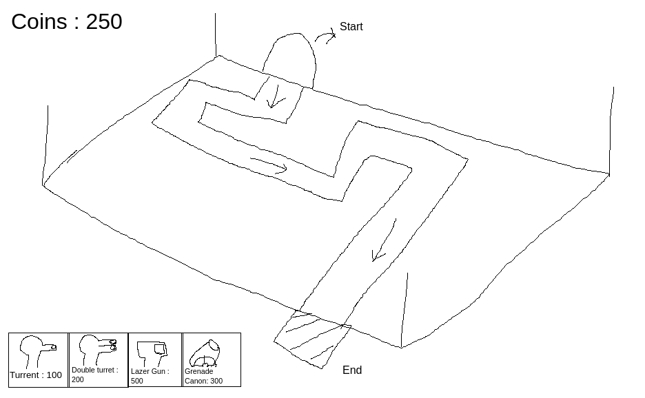

# Week 3: 

## The Game:

This week, we will be making a tower defence game. First lets talk about what tower defence games are -> 
"Tower defense (TD) is a subgenre of strategy games where the goal is to defend a player's territories or possessions by obstructing the enemy attackers or by stopping enemies from reaching the exits, usually achieved by placing defensive structures on or along their path of attack. This typically means building a variety of different structures that serve to automatically block, impede, attack or destroy enemies." 

Again, a big part of this game is going to be completing the game loop properly. 
The structure of the game is going to be quite different to your previous games.

## Roadmap:

### Basic elements -

* Main menu (try adding a settings button this time) 
* A level selector in main menu with 3 different levels.
* The levels should be progressively difficult.
* Bonus : Levels should be locked untill the previous level is beaten.

### How the game works -

Here is a beautiful image I drew in paint. The idea is this - 
The camera is fixed and on top of the map. You can make the camera isometric. 
The enemies start from the start point and travel across the fixed path. Their goal is to reach the end, and your goal is to stop them. You stop them by placing different towers to shoot the enemies down. You can imagine it like plants vs zombies. Killing the enemies give you coins, and those coins can be used to buy more towers.

Buying a tower should work as follows: Once you have enough money, the button is enabled and then once you click on it, you can click on the place you want to place the tower (it should not be in the path of the enemies). Once you have placed it, the money is deducted.

You can make multiple enemies, different healths, different amounts of coins they give, the pattern of their spawning (you can add a boss as always)

This time there will be only one learning resource which I think is important to know - 
https://medium.com/@austinjy13/screen-to-world-space-in-unity-for-3d-using-a-raycast-878759b2712b

Apart from that you are on your own. You are (obviously) free to look up learning resources.

